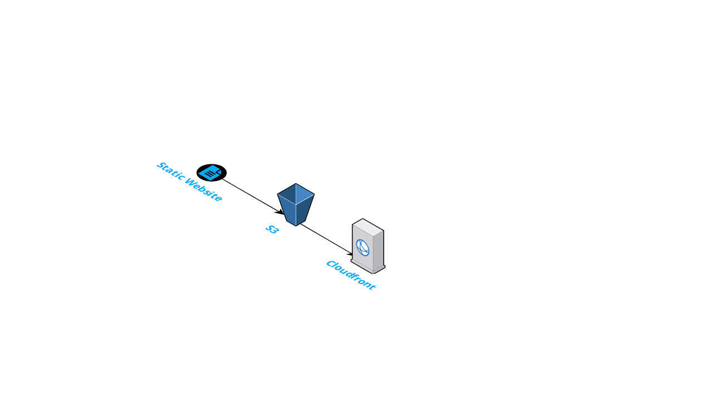

# Static Website Deployment on S3 and Cloudfront

## Prerequisite knowledge
- AWS S3
- AWS Cloudfront
- AWS CDK
- AWS SDK
- Typescript

## Background

A CDK Deployment of static website to S3 and Cloudfront

## Architecture


## How to replicate this

1. Clone this repository
1. Install [CDK](https://docs.aws.amazon.com/cdk/latest/guide/cli.html)
2. `npm install`
2. Set up your [AWS credentials](https://docs.aws.amazon.com/cli/latest/userguide/cli-configure-files.html)
3. Put your static website under `website` directory

## Deployment

Run these commands
```
cdk bootstrap
cdk deploy
```

Go to your AWS Console and go to [Cloudfront Service](https://console.aws.amazon.com/cloudfront/home) and get the domain name. Your website is available at `https://${your-domain}/index.html`. For example, if your domain is `d2v71ds80aobji.cloudfront.net`. Your website is at `https://d2v71ds80aobji.cloudfront.net/index.html`

## Future Improvements

Add Route 53 to resolve a domain to our existing cloudfront
